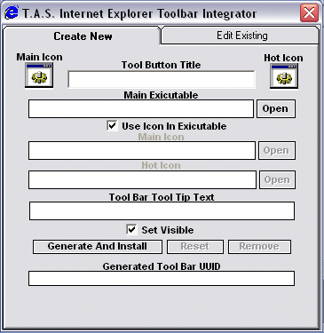



## T\.A\.S\. Internet Explorer Toolbar Integrator & Editor

### Description

The Internet Explorer Toolbar Integrator & Editor allows a user to integrate any program into the internet explorer tools menu & the tool bar with custom icons. Each time it integrates a new tool bar item it generates a uneek UUID number so that it wont interfere with any other software. Now has a full blown toolbar tools editor & better icon handling. It literally can extract the main icon out of all program files, irregardless what their index is & implement them.
 
### More Info
 

             |
---                |---
**Submitted On**   |2004-09-03 13:16:04
**By**             |[Thomas Swift](https://github.com/Planet-Source-Code/PSCIndex/blob/master/ByAuthor/thomas-swift.md)
**Level**          |Intermediate
**User Rating**    |4.8 (63 globes from 13 users)
**Compatibility**  |VB 6\.0
**Category**       |[Complete Applications](https://github.com/Planet-Source-Code/PSCIndex/blob/master/ByCategory/complete-applications__1-27.md)
**World**          |[Visual Basic](https://github.com/Planet-Source-Code/PSCIndex/blob/master/ByWorld/visual-basic.md)
**Archive File**   |[T\_A\_S\_\_Int178946932004\.zip](https://github.com/Planet-Source-Code/thomas-swift-t-a-s-internet-explorer-toolbar-integrator-editor__1-56002/archive/master.zip)

